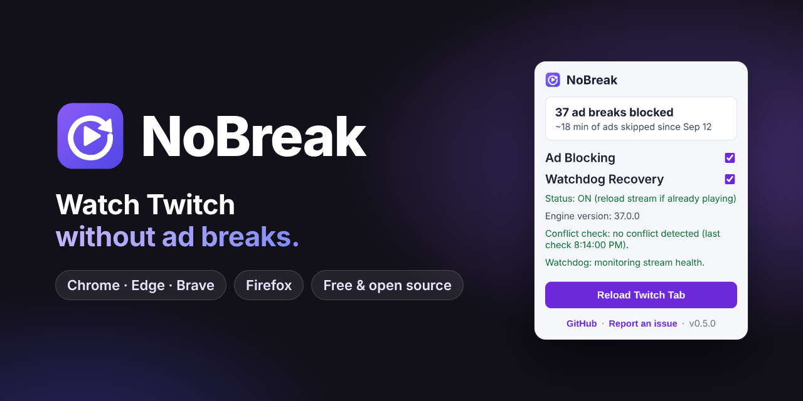
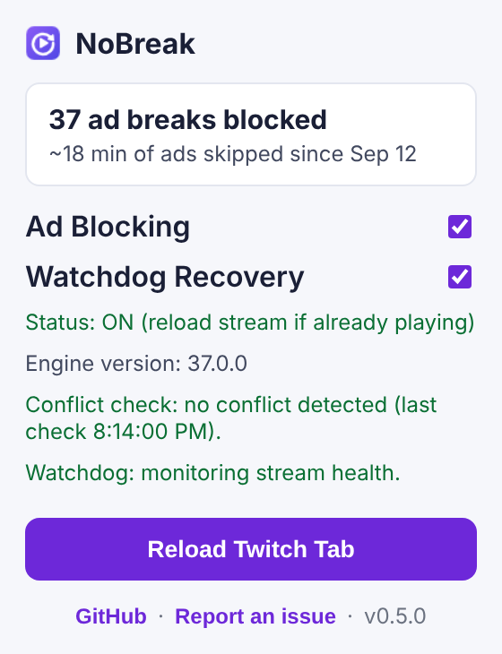

<p align="center">
  
</p>

<p align="center">
  <a href="https://github.com/eftenow/twitch-ads-blocker-one-click/releases/latest"></a>
  <a href="https://github.com/eftenow/twitch-ads-blocker-one-click/releases/latest"></a>
  <a href="https://github.com/eftenow/twitch-ads-blocker-one-click/releases"></a>
  <a href="LICENSE"></a>
  <a href="https://github.com/eftenow/twitch-ads-blocker-one-click/stargazers"></a>
</p>

<p align="center">
  <a href="https://github.com/eftenow/twitch-ads-blocker-one-click/releases/latest/download/twitch-ads-blocker-chrome-latest.zip"><b>Download for Chrome / Edge / Brave</b></a>
  &nbsp;·&nbsp;
  <a href="https://github.com/eftenow/twitch-ads-blocker-one-click/releases/latest/download/twitch-ads-blocker-firefox-latest.xpi"><b>Install for Firefox</b></a>
  &nbsp;·&nbsp;
  <a href="https://eftenow.github.io/twitch-ads-blocker-one-click/"><b>Website</b></a>
</p>

**NoBreak** is a free, open-source browser extension that keeps Twitch streams playing when an ad break starts.

It packages the `vaft` engine from [pixeltris/TwitchAdSolutions](https://github.com/pixeltris/TwitchAdSolutions), one of the most widely used Twitch ad-blocking scripts, into an extension you install in a minute. No uBlock Origin filters, no userscript manager, no settings to tweak.

## Features

- **Skips ad breaks.** When Twitch starts a pre-roll or mid-roll, NoBreak switches to an ad-free backup stream until the break is over.
- **Watchdog recovery.** If the stream freezes after an ad, NoBreak resumes it automatically.
- **Conflict detection.** Warns you when another Twitch ad blocker is running and fighting with it.
- **Stats.** See how many ad breaks were blocked and how much ad time you skipped.
- **Always current.** The engine is synced with upstream daily and released automatically. Firefox updates on its own; other browsers show an update notice in the popup.
- **Private.** No account, no analytics, no third-party servers. All code ships inside the extension; it only talks to Twitch and checks GitHub for new versions.

## Install

### Chrome, Edge, Brave, Opera, Vivaldi

1. [Download the latest package](https://github.com/eftenow/twitch-ads-blocker-one-click/releases/latest/download/twitch-ads-blocker-chrome-latest.zip).
2. Unzip it into a folder you'll keep. The browser loads the extension from that folder, so don't delete it.
3. Open `chrome://extensions` (Edge: `edge://extensions`).
4. Turn on **Developer mode**.
5. Click **Load unpacked** and select the unzipped folder.
6. Open Twitch and enjoy.

NoBreak isn't on the Chrome Web Store, which is why Chrome-based browsers need Developer mode.

### Firefox

1. Click **[Install for Firefox](https://github.com/eftenow/twitch-ads-blocker-one-click/releases/latest/download/twitch-ads-blocker-firefox-latest.xpi)**.
2. Click **Continue to Installation**, then **Add**.

The add-on is signed by Mozilla, stays installed and updates itself. Requires Firefox 140 or newer.

## Using it



Click the NoBreak icon in your toolbar:

- **Ad Blocking**: on by default. Reload the stream after turning it on.
- **Watchdog Recovery**: on by default. Recovers frozen streams with pause/play first, and a tab reload as a last resort.
- **Conflict check**: tells you if another Twitch ad blocker is active. Use only one at a time.
- **Reload Twitch Tab**: quick fix when a stream is stuck.

Updating on Chrome-based browsers: when the popup shows **Update available**, download the new package, replace the old folder and click **Reload** on the extensions page.

<br clear="right">

## How it compares

|  | NoBreak | uBlock Origin + vaft | TTV LOL PRO |
| --- | --- | --- | --- |
| Setup | Install the extension | Custom filter + advanced setting in uBlock Origin | Install the extension |
| Chrome | ✅ (Developer mode) | ❌ full uBlock Origin no longer runs on Chrome | ✅ Chrome Web Store |
| Firefox | ✅ signed, auto-updates | ✅ | ✅ |
| How ads are avoided | vaft backup streams, in your browser | Same vaft engine | Playlist requests go through proxy servers |
| Third-party servers | None | None | Proxy servers |

Every Twitch ad blocker breaks now and then when Twitch changes something. If one stops working, try another, and never run two at the same time.

## Troubleshooting

- **Still seeing ads or a purple screen?** Make sure you're on the [latest release](https://github.com/eftenow/twitch-ads-blocker-one-click/releases/latest), disable other Twitch ad blockers and reload the tab. Still broken? [Report it](https://github.com/eftenow/twitch-ads-blocker-one-click/issues/new?template=ads-showing.yml).
- **Stream freezes after an ad?** Keep Watchdog Recovery on, or click **Reload Twitch Tab**.
- **Popup shows a conflict?** Another Twitch ad blocker (a uBlock filter, userscript or extension) is running. Disable it and reload.
- **Something else?** [Open a bug report](https://github.com/eftenow/twitch-ads-blocker-one-click/issues/new?template=bug-report.yml).

## Limitations

- Twitch changes its ad delivery often, so breakage can happen without warning until the engine is updated.
- Ad breaks may briefly show lower quality or buffering while the backup stream is used.
- No ad blocker can guarantee ad-free playback on every stream and browser.

## For developers

<details>
<summary>Project layout, releases and automation</summary>

### Layout

- `extension/`: the extension itself (Manifest V3, shared by all browsers).
- `extension/injected/vaft.js`: the upstream engine, synced by `scripts/update-vaft.sh`. Never edit by hand.
- `extension/stats.js`, `extension/watchdog.js`, `extension/inject.js`: NoBreak's own content scripts.
- `scripts/`: packaging, Firefox signing and engine sync.
- `site/`: the landing page, deployed to GitHub Pages.

### Releasing

Bump `version` in `extension/manifest.json` on `main`. `.github/workflows/auto-release.yml` publishes any manifest version that has no release yet:

- Chrome / Edge / Firefox zips and `SHA256SUMS.txt`
- a Mozilla-signed `.xpi` (unlisted channel) plus `updates.json` for Firefox auto-updates. Needs repo secrets `AMO_JWT_ISSUER` and `AMO_JWT_SECRET`; without them the release goes out without the `.xpi`.

### Upstream sync

`.github/workflows/upstream-sync.yml` runs daily at 07:19 UTC. When upstream `vaft.js` changes it opens a PR with the patch version already bumped. Merging it publishes the release. Requires **Settings → Actions → General → Allow GitHub Actions to create and approve pull requests**.

### Local packaging

```bash
./scripts/package-stores.sh
AMO_JWT_ISSUER=... AMO_JWT_SECRET=... ./scripts/sign-firefox.sh
```

Artifacts are created in `dist/stores/<version>/`. Store submission steps: [`docs/store-publish-checklist.md`](docs/store-publish-checklist.md).

</details>

## Credits

The ad-blocking engine (`vaft`) is by [pixeltris/TwitchAdSolutions](https://github.com/pixeltris/TwitchAdSolutions), licensed under MIT ([license copy](third_party/LICENSE-pixeltris-TwitchAdSolutions.txt)). NoBreak adds the packaging, watchdog, conflict detection, stats and release automation around it.

## Support

If NoBreak saves you from ads, a ⭐ on GitHub helps other people find it.
